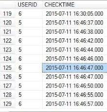

# Attendance System using Face Recognition

## Overview 
An efficient module that comprises Face-recognition using Opencv and Dlib libraries to manage the attendance record of students.

## Tools
| Logo | Tool |
| --- | --- |
|  | OpenCV for image processing |
|  | Dlib for face recognition and feature encoding |
|  | MySQL for database manipulation |

## Features
The features that have been deployed in this project are:
| Image | Feature | Description | 
| --- | --- | --- |
|  | Face Detection | In this feature, the machine accesses the webcam and detects the users’ face in order to recognize their name and id. |
|  | Monthly Attendance Count | A feature that enables the user to retrieve their monthly attendance count using MySQL queries. |
|  | Timestamp | This feature enables the user to mark their attendance in the timestamp (HH.MM.SS) format against their name and id. |

## Applications
* Automating the Attendance System
* Saving time and efforts
* Reducing human error
* Easy and accurate

## Future Scope
* Addition of in-time and out-time
* Time-duration calculation
* 3-D face detection
